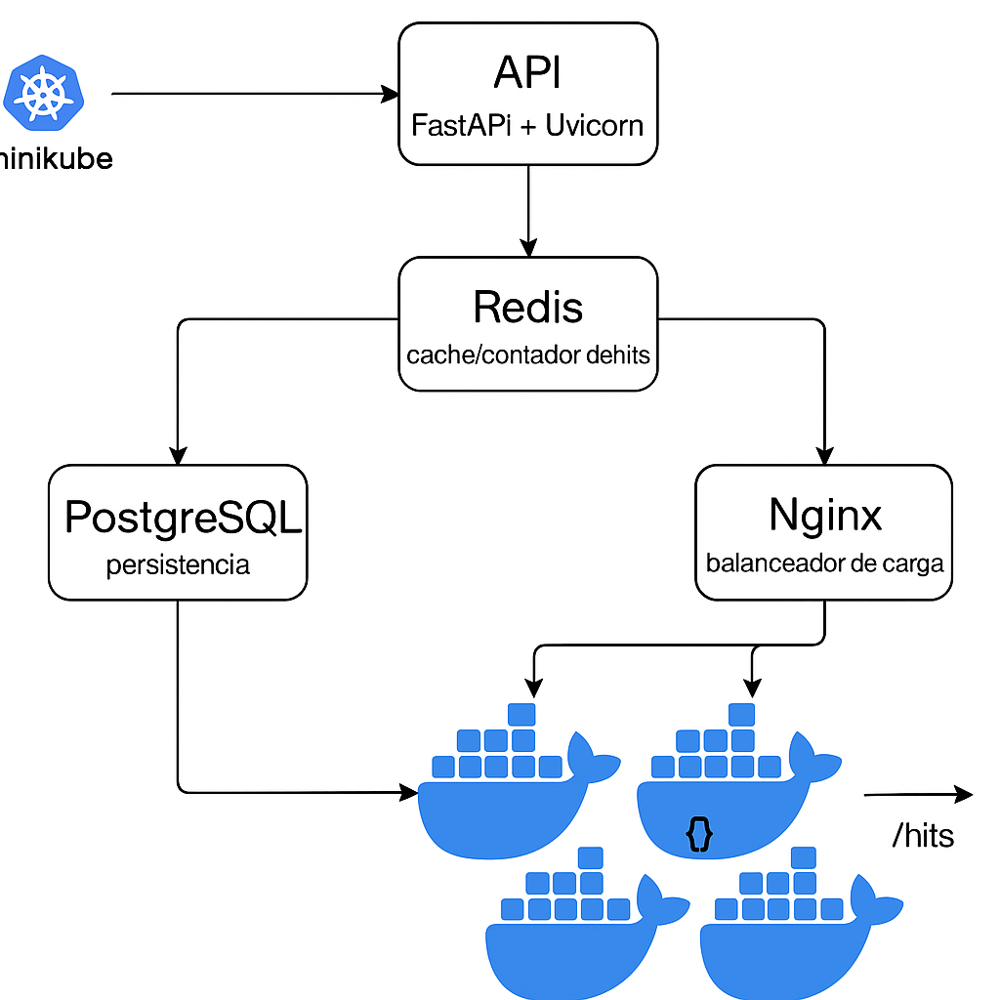

# 🚀 Sistema Distribuido con FastAPI + Kubernetes (Minikube)


Proyecto local para la materia de **Sistemas Distribuidos**.  
Se desplegó una API en **FastAPI** dentro de un clúster **Kubernetes (Minikube)** usando **múltiples réplicas (pods)** y un **Service NodePort** para exponer la app.


---

## 📦 Componentes del sistema

| Componente | Función |
|-----------|---------|
| FastAPI + Uvicorn | API HTTP que responde con el `hostname` del pod |
| Docker | Empaquetado de la app en una imagen |
| Kubernetes (Minikube) | Orquestación local y administración de pods |
| Deployment | Mantiene varias réplicas (3 pods) |
| Service (NodePort) | Expone la app y distribuye el tráfico entre pods |

---

## 🗂️ Estructura del proyecto

```bash
sistemas-distribuidos/
├── app/
│   └── main.py
├── k8s/
│   ├── app-deployment.yaml
│   └── app-service.yaml
├── assets/
│   └── arquitectura.png
├── Dockerfile
├── requirements.txt
└── README.md
---

##✅ Requisitos

    Docker

    Minikube

    kubectl
---

##🚀 Ejecución paso a paso
1) Iniciar Minikube

minikube start --driver=docker

2) Construir imagen dentro de Minikube

eval $(minikube docker-env)
docker build -t fastapi-app:latest .

3) Desplegar en Kubernetes

kubectl apply -f k8s/

4) Verificar recursos

kubectl get pods -o wide
kubectl get svc

5) Obtener URL del servicio

minikube service fastapi-service --url
---

##🧪 Evidencia de distribución (hostnames)

Cada petición puede ser atendida por un pod diferente.
El endpoint devuelve el hostname para evidenciar balanceo/distribución.

for i in {1..10}; do curl -s http://$(minikube ip):30007/; echo; done

Ejemplo de salida esperada:

{"mensaje":"Sistema Distribuido funcionando","hostname":"fastapi-app-xxxxx"}
{"mensaje":"Sistema Distribuido funcionando","hostname":"fastapi-app-yyyyy"}
---

##🧹 Limpieza

kubectl delete -f k8s/
---

##👤 Autor

    GitHub: YORYI777
